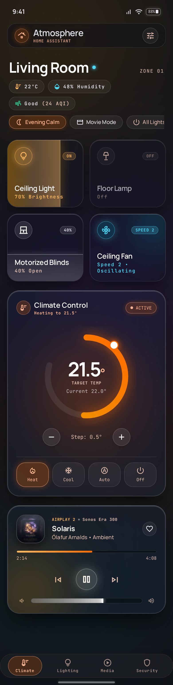
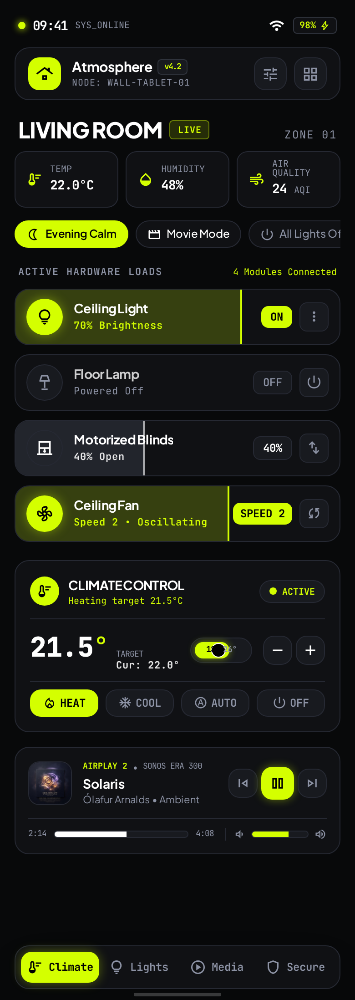
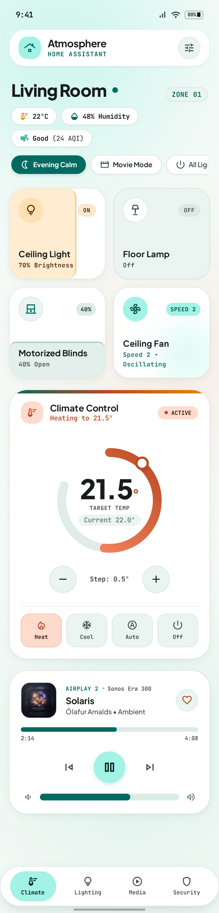

# Glide Card

Themeable Home Assistant cards: buttons with swipe-to-dim, real pop-up sheets, a floating nav bar, climate and media cards.
It's one card type with three built-in designs, and adding a new design takes one file.

| Liquid Glass | Refined Bubble | Material You |
| --- | --- | --- |
|  |  |  |

## Install

**HACS:** add this repo as a custom repository (type *Dashboard*), install **Glide Card**, then reload.

**Manual:** copy `dist/glide-card.js` to `/config/www/`, then add it as a dashboard resource: `/local/glide-card.js` (JavaScript module).

## Cards

Every card is `type: custom:glide-card` plus a `card_type`. All of them can be edited in the visual editor.

```yaml
# Button: tap = toggle, hold = more-info, swipe sideways = brightness / position / speed
type: custom:glide-card
card_type: button
entity: light.ceiling
layout: tile        # tile | pill (default comes from the theme)

# Pop-up sheet: opens when the URL hash matches; bottom sheet on phones, centered modal on wide screens
type: custom:glide-card
card_type: popup
hash: "#kitchen"
title: Kitchen
icon: mdi:silverware-fork-knife
cards:
  - type: custom:glide-card
    card_type: button
    entity: switch.coffee
  - type: tile          # any HA card works inside
    entity: light.kitchen

# Open it from anywhere (the tile morphs into the sheet)
type: custom:glide-card
card_type: button
entity: light.kitchen
tap_action:
  action: navigate
  navigation_path: "#kitchen"

# Floating nav bar
type: custom:glide-card
card_type: nav
items:
  - { name: Home, icon: mdi:home, navigation_path: /dashboard-home/0 }
  - { name: Kitchen, icon: mdi:silverware-fork-knife, navigation_path: "#kitchen", entity: light.kitchen }
  - { name: More, icon: mdi:dots-grid, navigation_path: "#more", pinned: true }   # stays at the end
# Items that don't fit scroll sideways and the current page is centred.

# Page title + subtitle
type: custom:glide-card
card_type: title
title: משפחת שיש
subtitle: גם כשלא היה הרבה, היה לנו הכל

# Section heading (use instead of HA's heading card)
type: custom:glide-card
card_type: heading
title: תריסים
icon: mdi:blinds
color: purple
subtitle: 1 פתוח          # optional
style: title              # title | subtitle (smaller)
badges:                   # optional mini entity badges at the end
  - entity: sensor.living_temp
    icon: mdi:thermometer
tap_action:               # optional; shows a chevron
  action: navigate
  navigation_path: /home-glass/blinds

# Info chips row (scrolls sideways when it doesn't fit)
# weather = "condition · temp", timestamp sensors = "06:40", numbers keep their unit
type: custom:glide-card
card_type: chips
chips:
  - entity: weather.home
  - entity: sensor.sun_next_rising
    icon: mdi:weather-sunset-up
    color: amber
  - entity: sensor.mspr_mzgnym_dvlqym
    name: מזגנים דולקים
    icon: mdi:air-conditioner
    color: light-green
    tap_action:
      action: navigate
      navigation_path: /home-glass/climate

# Climate (drag the dial) and media
type: custom:glide-card
card_type: climate
entity: climate.living
---
type: custom:glide-card
card_type: media
entity: media_player.sonos
```

### Templates (buttons)

A button's `name`, `secondary` (the line under the name), `badge` (the corner pill), `icon` and `color` accept Home Assistant templates, like a Mushroom template card. Home Assistant renders them and updates them live. On/off still follows `entity`. A button with no `entity` works as a summary tile.

```yaml
type: custom:glide-card
card_type: button
name: Lights
icon: mdi:lightbulb-group
secondary: >-
  
  {{ lights | select('is_state', 'on') | list | count }} of {{ lights | count }} on
badge: "{{ states('sensor.outdoor_lights_on') }} outside"
color: "{{ 'amber' if is_state('light.living_room', 'on') else 'grey' }}"
tap_action:
  action: navigate
  navigation_path: "#lights"
```

`secondary` replaces the automatic brightness/position text, and `badge` replaces the state. All of these also take plain text. In the visual editor, they're under **Templates**.

### Chip visibility

A chip shows only while its `visibility` conditions all pass. The format is the same as Home Assistant's card visibility: `state` (`state` / `state_not`, one value or a list), `numeric_state` (`above` / `below`), `and`, `or`. The chip row updates live and hidden chips leave no gap.

```yaml
type: custom:glide-card
card_type: chips
chips:
  - entity: sensor.jewish_calendar_upcoming_shabbat_candle_lighting
    name: כניסת שבת
    icon: mdi:candle
    color: amber
    visibility:
      - condition: state
        entity: sensor.shabbat_phase
        state: candle_lighting
```

### Shared options

| Option | Values |
| --- | --- |
| `theme` | `glass` (default), `bubble`, `material`, or any registered theme |
| `mode` | `auto` (follows HA), `dark`, `light` |
| `accent` | any CSS color; overrides the theme accent |
| `color` | buttons only: an HA color name (`cyan`, `light-blue`, `amber`...) or any CSS color; replaces the per-domain color |
| `lite` | `true` turns off blur for slow tablets. When unset, it's detected automatically. Per device: `localStorage["glide-card-lite"]="1"` |
| `tap_action` / `hold_action` / `double_tap_action` | standard HA actions, plus `navigate` to a `#hash` to open a pop-up |
| `tap_animation` | animation on tap (buttons, chips, heading badges, nav bar; a pop-up passes it to its cards): `shine` (default), `random` (a different effect each tap, only ones the widget can show, never the same twice in a row), `press`, `spring`, `ripple`, `glow`, `jelly`, `tilt`, `icon-pop`, `ring`, `deep-press`, `bloom`, `breathe`, `sparks`, `icon-flip`, `border-trace`, `nudge`, `badge-pop`, `none`. Turned off when the device asks for reduced motion |
| `size` | `full` (default), `compact` (same layouts, tighter) or `slim` (the minimum: one-row tiles, one-line chips, a one-line media player, a small climate dial with −/+ beside it, an icon-only nav). In a sections dashboard tiles, media and climate shrink by whole grid rows. A pop-up passes it to its cards |

**Dashboard-wide theme:** add `glide-theme: bubble` to your HA theme YAML. A card's own `theme` still wins.

**Dashboard-wide tap animation:** add `glide-tap-animation: ripple` to your HA theme YAML. A card's own `tap_animation` still wins.

**Dashboard-wide size:** add `glide-size: slim` (or `compact`) to your HA theme YAML. A card's own `size` still wins.

## Themes

A theme is one object containing semantic tokens (`--gc-surface`, `--gc-accent`, `--gc-radius`, `--gc-backdrop`, ...), optional extra CSS per card type, and layout defaults. Cards only read tokens, so a new design never touches card code.

- **Built-in:** add `src/themes/<id>/index.ts` (copy `glass`) and list it in `src/themes/index.ts`.
- **From another HACS resource:** `window.glideCardThemes.register({ id, name, version, preview, tokens: { dark, light } })`.

See `src/themes/types.ts` for the full token contract.

## Develop

```bash
npm install
npm run dev     # playground with mock HA: themes, dark/light, Hebrew RTL, phone/tablet/desktop
npm test
npm run build   # -> dist/glide-card.js
```
